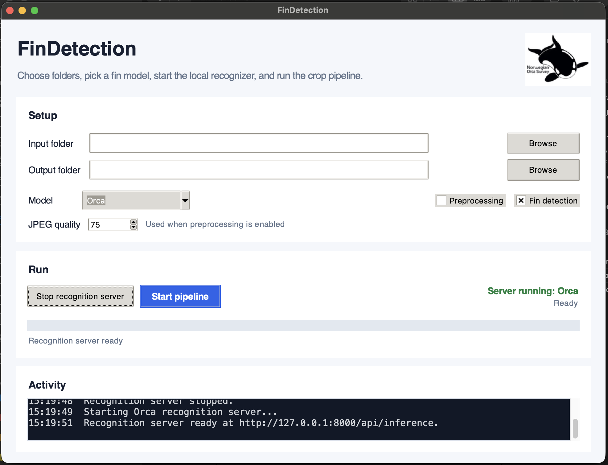

# Local FinDetection

This repository contains all scripts necessary to train a local YOLO model to detect fins, serve that model through a Finwave-compatible API, and lets `scripts/fin_finder.py` crop detected fins from image
folders without calling the remote detection service.

There is an easy to use desktop app build on top of the scripts to enable easy use everyday.




**Warning:** A LOT of vibe coding has been used. Please enjoy with caution ;)

## Attribution

Credit to [Alexander Barnhill](https://github.com/alexanderbarnhill/) for the
original project context and related work.

In collaboration with [Norwegian Orca Project](https://www.norwegianorcasurvey.no/).


## Setup

Create and activate a Python environment, then install the project dependencies:

```bash
python3 -m venv .venv
source .venv/bin/activate
python3 -m pip install -r requirements.txt
```

## Desktop Tool

For day-to-day use without the command line, open:

```text
LaunchFinDetectionTool.command
```

On first launch, the command checks the local Python environment and installs
missing packages from `requirements.txt` if needed.

The desktop tool lets you:

- choose an input folder
- choose an output folder
- run preprocessing only, fin detection only, or both
- set JPEG quality for preprocessing
- choose any recognition model found in the `models` folder
- start the local recognition server
- run the fin-cropping pipeline with progress feedback

The app discovers available weights from `models/model_<name>.pt` and displays
`<name>` with underscores replaced by spaces and its first letter capitalized.
Add an optional matching
`models/logo_<name>.png` or `models/logo_<name>.jpeg` to show a model logo.

For preprocessing-only runs, JPEGs are saved directly in the selected output
folder. When preprocessing and fin detection are both enabled, intermediate
JPEGs are saved under `preprocessed_images` inside the selected output folder.
Fin crops are saved in the selected output folder while preserving the input
folder structure.

## Dataset Layout

The training script expects this layout:

```text
cropping_dataset/
  original/      source images
  yolo_labels/   YOLO label files with matching image stems
```

Each label file should use standard YOLO detection format:

```text
class_id center_x center_y width height
```

Coordinates are normalized from `0` to `1`. The fin class is class `0`.

The training dataset was taken from [Alexander Barnhill work](https://zenodo.org/records/16786268).

### Creating YOLO Labels

To create labels from manually cropped fins, place the source images in
`<dataset-root>/original` and the corresponding crops in
`<dataset-root>/cropped`, then run
`python3 scripts/create_yolo_labels.py --dataset-root <dataset-root>`. The
script matches each crop back to its original image using the filename stem and
template matching, writes the bounding boxes to `<dataset-root>/yolo_labels`,
and creates JSON and CSV reports so unmatched filenames, low-confidence
matches, and errors can be reviewed; use `--dry-run` to check the matches
without writing label files.

## Training

Use [scripts/train_findetection.py](scripts/train_findetection.py) to prepare a YOLO-compatible
dataset split and fine tune a pretrained YOLO model.

```bash
python3 scripts/train_findetection.py
```

By default, it:

- reads images from `cropping_dataset/original`
- reads labels from `cropping_dataset/yolo_labels`
- creates train/validation/test splits under `runs/findetection_dataset`
- trains from `base_models/yolo11n.pt`
- writes training outputs under `runs/findetection_training/fin_yolo`
- saves learning graphs and summaries after training

Useful options:

```bash
python3 scripts/train_findetection.py --model base_models/yolo11n.pt --epochs 100  --device mps --dataset-root "/Users/paul/Desktop/NOS/orca_cropping_dataset"
python3 scripts/train_findetection.py --model base_models/yolov8n.pt --epochs 100 --device mps
python3 scripts/train_findetection.py --skip-train
python3 scripts/train_findetection.py --copy-mode copy
```

Important outputs:

```text
runs/findetection_training/fin_yolo/weights/best.pt
runs/findetection_training/fin_yolo/learning_losses.png
runs/findetection_training/fin_yolo/validation_metrics.png
runs/findetection_training/fin_yolo/training_summary.txt
runs/findetection_training/fin_yolo/training_summary.json
```

## Local Detection Server

Use [scripts/spawn_findetection_server.py](scripts/spawn_findetection_server.py) after training
has produced `best.pt`.

```bash
python3 scripts/spawn_findetection_server.py
```

The server defaults to:

```text
http://127.0.0.1:8000/api/inference
```

and loads:

```text
models/model_risso.pt
```

Override the model path or device when needed:

```bash
python3 scripts/spawn_findetection_server.py --model-path path/to/best.pt
python3 scripts/spawn_findetection_server.py --device mps
python3 scripts/spawn_findetection_server.py --host 0.0.0.0 --port 8000
```

The local `/fin-detect` endpoint mirrors the remote Finwave response shape:

```json
{
  "response": {
    "sourceId": null,
    "croppedImages": ["base64-jpeg"],
    "extractedImages": ["base64-jpeg"],
    "proportionBoxes": [],
    "absoluteBoxes": []
  }
}
```

`croppedImages` matches the current remote API field. `extractedImages` is
included as a compatibility alias for the existing client code.

The server also exposes `/vvi-detect` as a simple compatibility endpoint that
returns crops as valid.

## Cropping Pipeline

Use [scripts/fin_finder.py](scripts/fin_finder.py) to process image folders through the local
detection server and save cropped fin images.

```bash
python3 scripts/fin_finder.py
```

The GUI lets you set input and output directories. The default detection base
URL is:

```text
http://127.0.0.1:8000/api/inference
```

Start `scripts/spawn_findetection_server.py` before starting the pipeline.

## Tests

Due to the large amount of Vibe-Coding used in the development, a large suit of test was implemented (by Codex, so the effectiveness is tbd :) ).


Special cases for the actual use of the program include:
- Non-JPEG input for FinDetection
- Nested input folders
- Output folders located inside the input tree

General cases for functionality:
- Models with missing or unmatched logos
- Empty input folders and identical input/output paths
- Corrupt JPEG handling without stopping the remaining batch
- Detection-server timeouts, retries, errors, and malformed responses
- Both `croppedImages` and `extractedImages` API responses
- Unique crop names for multiple fins
- Duplicate source names in separate nested folders
- PNG, TIFF, and RAW preprocessing
- Missing `rawpy` errors
- Pipeline cancellation and state reset
- PNG and JPEG model-logo loading
- Complete preprocessing and detection pipeline execution

Run them from the repository root with `python -m unittest discover -s tests`.
